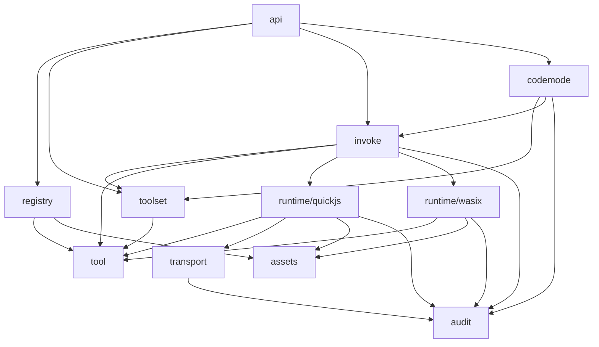

# Architecture

This document captures the current high-level package architecture for `github.com/solidarity-ai/toolbox`.

The design is centered around three ideas:

1. **`tool` defines what exists** — static package and tool definitions.
2. **`toolset` defines what is available for one request** — bindings, context, credentials, and the agent-visible view.
3. **`invoke` is the one place that executes a single tool call correctly** — API and CodeMode both go through it.

## Package overview

- `tool` — static tool and package definitions
- `toolset` — request-scoped assembly and validation
- `audit` — shared execution and HTTP event vocabulary
- `transport` — outbound HTTP mediation, credential injection, and audit capture
- `assets` — non-tool executable/package assets
- `registry` — package acquisition and caching
- `runtime/quickjs` — TypeScript tool execution
- `runtime/wasix` — native WASM execution via the Rust host
- `invoke` — orchestration for one tool call
- `codemode` — code session semantics against a toolset
- `api` — MCP/HTTP protocol translation

## Dependency diagram



## Main data flows

### 1. Package loading

```text
API / harness
  -> registry
  -> loaded package artifact
     - manifest
     - tool definitions
     - asset references / blobs
```

### 2. Request-scoped tool assembly

```text
API / harness
  -> toolset
     inputs:
       - selected tools
       - bindings
       - context
       - credentials
  -> resolved toolset
     outputs:
       - bound tools
       - compiled expressions
       - agent-visible schemas
       - validation plan
```

### 3. Single tool invocation

```text
API or CodeMode
  -> invoke
     inputs:
       - resolved toolset
       - tool name
       - call params
  -> runtime selection
     -> runtime/quickjs   for TS tools
     -> runtime/wasix     for native WASM tools
  -> normalized result + audit
```

### 4. TypeScript runtime flow

```text
invoke
  -> runtime/quickjs
  -> host imports (fetch / exec / log / mcp)
  -> transport for outbound HTTP calls
  -> audit events
  -> normalized execution result
```

### 5. Native WASM runtime flow

```text
invoke
  -> runtime/wasix
  -> Rust host subprocess
  -> WASIX sandboxed execution
  -> proxy/open networking
  -> audit events
  -> normalized execution result
```

### 6. CodeMode flow

```text
API / harness
  -> codemode
     inputs:
       - resolved toolset
       - agent code
  -> repeated calls into invoke
  -> session result + aggregated audit
```

## Boundary table

| Package | Receives | Returns | Communication style |
|---|---|---|---|
| `registry` | package ref / version / lookup intent | loaded package artifact | synchronous, cache-backed IO |
| `tool` | static definition data | validated definition models | shared vocabulary only |
| `toolset` | selected tools, bindings, context, credentials | resolved toolset, agent view, validation errors | synchronous, request-scoped assembly |
| `transport` | outbound request + execution context | outbound response + HTTP audit + transport errors | synchronous, per-call capability boundary |
| `runtime/quickjs` | TS tool artifact, resolved params, execution context | runtime result, logs, runtime errors | synchronous, in-process sandbox |
| `runtime/wasix` | native WASM execution request | subprocess result, stdout/stderr, runtime error | synchronous, subprocess boundary |
| `invoke` | resolved toolset, selected tool, params, request metadata | normalized invocation result + audit | synchronous orchestration |
| `codemode` | resolved toolset, agent code, session config | code session result + aggregated audit | synchronous session execution |
| `api` | MCP/HTTP protocol requests | protocol responses | synchronous translation layer |
| `assets` | asset lookup request | resolved asset refs / blobs / cache hits | synchronous lookup |
| `audit` | event objects from producers | shared event schemas | value-object boundary |

## Invariants

These are the most important architectural rules to preserve:

1. **`api` does not call runtimes directly.**
   - `api` only uses `registry`, `toolset`, `invoke`, and `codemode`.

2. **`codemode` does not call runtimes directly.**
   - `codemode` delegates tool execution to `invoke`.

3. **Runtimes do not understand request semantics.**
   - `runtime/quickjs` and `runtime/wasix` receive prepared execution requests only.
   - They do not know about bindings, toolset rules, or context semantics.

4. **CEL stays inside `toolset`.**
   - Expression compilation/evaluation is an implementation detail of request-scoped assembly.
   - It should not become a system-wide concept that other packages reason about directly.

5. **`invoke` is the single execution seam.**
   - If the meaning of "run a tool" changes, it should change in `invoke` first.

## Practical reading order

If you are new to the repo, read the package docs in this order:

1. `tool/README.md`
2. `toolset/README.md`
3. `invoke/README.md`
4. `runtime/quickjs/README.md`
5. `runtime/wasix/README.md`
6. `codemode/README.md`
7. `transport/README.md`
8. `registry/README.md`
9. `api/README.md`
