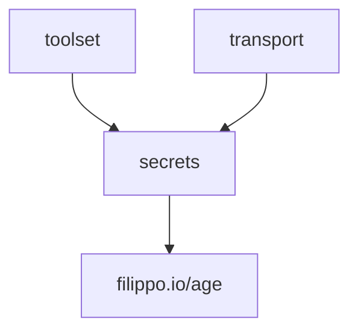

# Secrets Package — Implementation Plan

## Overview

The `secrets` package provides a foundational secret store for toolbox. Config (coming later) will reference secrets by key, and the store resolves them. The store is independent of all other toolbox packages — it sits at the bottom of the dependency graph alongside `tool` and `audit`.

---

## Package Layout

```
secrets/
  secrets.go          # SecretStore interface, error types, key validation
  local.go            # LocalSecretStore — age-encrypted file-backed store
  local_test.go       # Tests for LocalSecretStore

testutil/
  secrets.go          # TestSecretStore — plaintext in-memory implementation
```

`testutil/` already exists at the repo level (contains `mcptest/`, `servicetest/`, `tooltest/`, `fixtures/`). The secrets test helper will be added there.

---

## Interface Definition

```go
// secrets/secrets.go

package secrets

type SecretStore interface {
    Get(ctx context.Context, key string) ([]byte, error)
    Set(ctx context.Context, key string, value []byte) error
    Delete(ctx context.Context, key string) error
    List(ctx context.Context, prefix string) ([]string, error)
}
```

Keys are flat strings with `/`-delimited namespacing (e.g. `system/ca_cert`, `tenant/acme/gws_oauth`). The store treats them as opaque strings — it does not interpret hierarchy. `List` does a simple prefix match on the full key string.

---

## LocalSecretStore Design

### Constructor

```go
func NewLocalSecretStore(storePath string, identityPath string) *LocalSecretStore
```

- `storePath` — path to the age-encrypted store file on disk. If empty, defaults to `$XDG_CONFIG_HOME/toolbox/secrets` (falling back to `~/.config/toolbox/secrets`). If the file does not exist, the store starts empty and creates it on first `Set`.
- `identityPath` — path to the age identity file (private key). If empty, defaults to `$XDG_CONFIG_HOME/age/keys.txt` (falling back to `~/.config/age/keys.txt`), matching the `age` CLI convention.

Both defaults use Go's `os.UserConfigDir()` which reads `$XDG_CONFIG_HOME` on Linux/BSDs and falls back to `~/.config` when unset. On macOS it returns `~/Library/Application Support`, on Windows `%AppData%`.

The constructor does not perform I/O. All I/O is deferred to first access (lazy unlock).

### File Format

The store file is a single age-encrypted blob. When decrypted, the plaintext is JSON:

```json
{
  "system/ca_cert": "PEM-encoded-cert-base64...",
  "tenant/acme/gws_oauth": "token-bytes-base64..."
}
```

The Go type backing this is `map[string][]byte`. Go's `encoding/json` automatically handles `[]byte` as base64, so serialization is straightforward.

A single-file design is chosen over a directory-of-files approach because:
- The expected secret count is small (tens, not thousands)
- Atomic writes are simpler with a single file
- A single encrypted blob leaks less metadata (no filenames revealing key names)

### Age Identity Resolution

1. Open the identity file at `identityPath` (or the default path).
2. Call `age.ParseIdentities()` to get `[]age.Identity`.
3. These identities are cached on the struct for the session lifetime — the identity file is read once.

For encryption (writing the store back), we need the corresponding `age.Recipient`. Since the identity file contains `age.X25519Identity` values, we call `.Recipient()` on the first parsed identity to get the `age.X25519Recipient` for re-encryption.

### Unlock Flow

Unlock is lazy — triggered on the first call to any method (`Get`, `Set`, `Delete`, `List`).

```
First method call
  → ensureUnlocked()
      → sync.Once
      → read identity file, parse identities via age.ParseIdentities()
      → extract recipient from first identity (for re-encryption)
      → if store file exists:
          → read encrypted file
          → age.Decrypt(file, identities...)
          → json.Unmarshal into map[string][]byte
      → if store file does not exist:
          → initialize empty map
      → store map + identities on struct
```

If unlock fails (bad identity file, corrupted store, wrong key), the error is captured and returned on every subsequent call. There is no retry — the caller must create a new store instance.

### In-Memory Cache

After unlock, the full decrypted map lives in memory for the session lifetime. All reads (`Get`, `List`) hit the map directly. All mutations (`Set`, `Delete`) update the map and then flush to disk.

### Flush (Write-Back)

On every mutation:
1. `json.Marshal` the in-memory map.
2. Encrypt using `age.Encrypt()` with the stored recipient.
3. Write to a temp file in the same directory.
4. `os.Rename` the temp file over the store file (atomic on POSIX).

This ensures the on-disk store is always consistent. The write path is:

```
Set/Delete
  → update in-memory map
  → json.Marshal(map)
  → age.Encrypt(tmpFile, recipient)
  → write plaintext to age writer, Close() the writer
  → os.Rename(tmpFile, storePath)
```

### Thread Safety

```go
type LocalSecretStore struct {
    storePath    string
    identityPath string

    once      sync.Once
    unlockErr error

    mu        sync.RWMutex
    data      map[string][]byte
    identities []age.Identity
    recipient  age.Recipient
}
```

- `sync.Once` guards the unlock flow — only one goroutine performs initialization.
- `sync.RWMutex` guards the in-memory map:
  - `Get` and `List` take a read lock.
  - `Set` and `Delete` take a write lock (covering both the map update and the flush).

---

## TestSecretStore Design

```go
// testutil/secrets.go

package testutil

type TestSecretStore struct {
    mu   sync.RWMutex
    data map[string][]byte
}

func NewTestSecretStore() *TestSecretStore
```

- Plaintext in-memory map — no encryption, no disk I/O.
- Implements `secrets.SecretStore`.
- Thread-safe via `sync.RWMutex` (same pattern as the real store).
- `Get` returns `secrets.ErrNotFound` for missing keys (same contract as `LocalSecretStore`).
- Optional: a `Seed(entries map[string][]byte)` method to prepopulate secrets for test setup.

---

## Error Types

```go
// secrets/secrets.go

// ErrNotFound is returned when a key does not exist in the store.
var ErrNotFound = errors.New("secret not found")

// ErrInvalidKey is returned when a key is empty or otherwise malformed.
var ErrInvalidKey = errors.New("invalid secret key")
```

Other failure modes (identity file not found, decryption failure, disk I/O errors) are returned as wrapped errors from the underlying operations — no custom types needed. Callers can use `errors.Is(err, ErrNotFound)` for the common "key doesn't exist" check.

### Error Behavior by Method

| Method | Key missing | Store locked/failed |
|--------|-------------|---------------------|
| `Get` | `ErrNotFound` | unlock error (wrapped) |
| `Set` | creates key | unlock error (wrapped) |
| `Delete` | `ErrNotFound` | unlock error (wrapped) |
| `List` | empty slice | unlock error (wrapped) |

---

## Dependency Graph Placement

`secrets` has **no dependencies** on other toolbox packages. It depends only on:
- `filippo.io/age` (encryption)
- Go stdlib (`context`, `encoding/json`, `os`, `sync`, `io`, `path/filepath`)

Future consumers (not part of this work):
- `toolset` — credential resolution during request-scoped assembly will read secrets
- `transport` — credential injection for outbound HTTP calls may read secrets
- `api` — may wire the secret store into the application lifecycle



The `testutil` package depends on `secrets` (to implement the interface).

---

## Open Questions

1. **Delete semantics for missing keys** — should `Delete` of a nonexistent key return `ErrNotFound` or silently succeed (idempotent delete)? The plan above returns `ErrNotFound`, but idempotent deletes are common in key-value stores. Needs a decision.

2. **Multiple identities** — the identity file may contain multiple identities. Decryption tries all of them (age handles this). For encryption, the plan uses the first identity's recipient. Should we encrypt to all identities' recipients instead? This would allow any of them to decrypt, which is useful if the user rotates keys.

3. **Store file permissions** — should `NewLocalSecretStore` enforce `0600` permissions on the store file? The identity file permissions are the age CLI's concern, but the store file is ours. Enforcing strict permissions is good practice for secret material.

4. **Password-based encryption (scrypt)** — the plan assumes X25519 identity files (the age CLI default). Should we also support password-based encryption via `age.ScryptRecipient`? This would allow users without an age identity file to protect their store with a passphrase. Could be a follow-up.

5. **Store file directory creation** — if `storePath` points to a file in a directory that doesn't exist, should `Set` create intermediate directories? Or require the parent directory to exist?

6. **Key validation rules** — the plan validates that keys are non-empty. Should we enforce further constraints (e.g., no leading/trailing slashes, valid UTF-8, max length)? Keeping it minimal for now, but worth deciding.

7. **Context usage** — the interface accepts `context.Context` for future-proofing (e.g., remote backends). The local implementation will check for context cancellation but otherwise doesn't use it. Is this the right tradeoff, or should the local backend skip context entirely and let a future remote backend add it?
